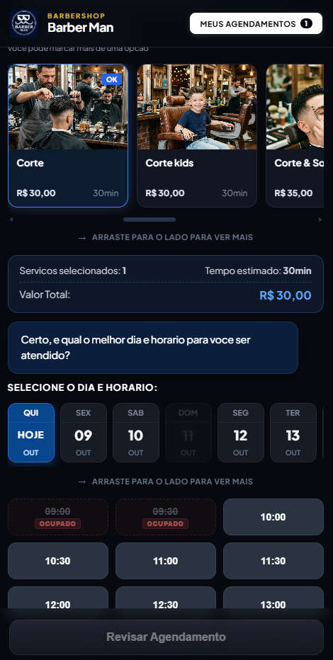
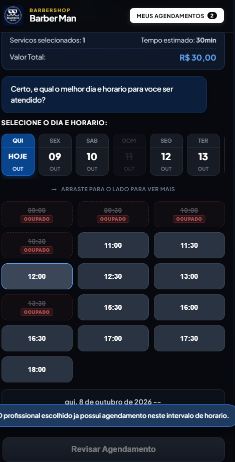
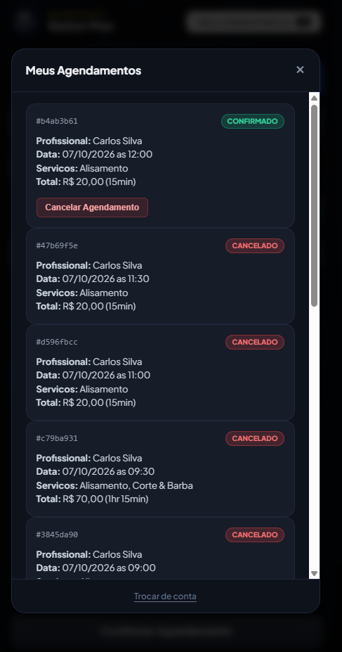

# Barber Man - Sistema de Agendamento Inteligente

Sistema web completo de agendamento online e gestão para barbearia, projetado com arquitetura em camadas (MVC), concorrência atômica com bloqueio pessimista no banco de dados e interface responsiva em tempo real.

---

## Sumario

- [Visao Geral](#visao-geral)
- [Demonstracoes e Telas](#demonstracoes-e-telas)
- [Arquitetura e Padroes](#arquitetura-e-padroes)
- [Garantia de Concorrencia e Atomicidade](#garantia-de-concorrencia-e-atomicidade)
- [Tecnologias Utilizadas](#tecnologias-utilizadas)
- [Estrutura do Projeto](#estrutura-do-projeto)
- [Como Executar o Projeto](#como-executar-o-projeto)
- [Endpoints da API](#endpoints-da-api)
- [Variaveis de Ambiente](#variaveis-de-ambiente)

---

## Visao Geral

O **Barber Man** oferece um fluxo conversacional fluido para o cliente final:
1. Identificacao rapida via telefone/e-mail com reconhecimento de historico.
2. Escolha do profissional (barbeiro).
3. Selecao multipla de servicos com calculo automatico de duracao acumulada e valor total.
4. Selecao de data e horario disponivel considerando a duracao dos cortes selecionados (ex.: corte de 1 hora bloqueia dois slots consecutivos de 30 minutos).
5. Consulta e cancelamento de agendamentos no painel "Meus Agendamentos".

---

## Demonstracoes e Telas

### 1. Fluxo de Agendamento Mobile
Interface desenhada para dispositivos moveis com experiencia conversacional guiada, carrossel de servicos e seletor de horarios.



---

### 2. Garantia de Concorrencia e Atomicidade
Demonstracao de protecao contra overbooking: caso dois usuarios tentem confirmar o mesmo horario simultaneamente, a transacao concorrente e bloqueada no banco e o frontend exibe o aviso imediato de conflito.



---

### 3. Painel "Meus Agendamentos"
Listagem dos agendamentos confirmados pelo cliente, permitindo visualizacao de barbeiro, servicos, valor e acao de cancelamento direto.



---

## Arquitetura e Padroes

O sistema segue rigorosamente o padrao **MVC (Model-View-Controller)** com separacao estrita de responsabilidades:

- **Model (Entidades e Persistencia)**:
  - Entidades JPA (`Appointment`, `Client`, `Barber`, `ServiceItem`).
  - Repositorios Spring Data com consultas customizadas e controle de lock no PostgreSQL.
- **View (Interface do Usuario)**:
  - Frontend SPA com Vue 3 (Composition API), CSS3 customizado com modo escuro e design responsivo, servido via Nginx.
- **Controller & Service (Regras de Negocio)**:
  - Controladores REST recebendo e validando DTOs (`@Valid`).
  - Camada de servico com regras transacionais (`@Transactional`) isolando as operacoes de reserva e cancelamento.

---

## Garantia de Concorrencia e Atomicidade

Para impedir agendamentos duplicados ou horarios sobrepostos por multiplos usuarios simultaneos:

1. **Lock Pessimista no Banco de Dados (`PESSIMISTIC_WRITE`)**:
   Ao iniciar a gravacao do agendamento, o backend bloqueia as linhas relevantes do barbeiro naquele periodo (`SELECT ... FOR UPDATE`), forçando a fila serializada das transacoes concorrentes.
2. **Calculo Dinamico de Duracao e Overlap**:
   Se um cliente escolhe servicos somando 60 minutos (ex.: Corte + Barba), o sistema verifica a disponibilidade do intervalo inteiro `[inicio, inicio + duracao)`. O horario subsequente e automaticamente indisponibilizado.
3. **Restricao Unica Parcial no PostgreSQL**:
   Indice exclusivo no banco (`idx_unique_barber_active_slot`) garantindo integridade no nivel de armazenamento para agendamentos com status ativo.
4. **Sincronizacao em Tempo Real**:
   O frontend utiliza polling reativo aliado a eventos `BroadcastChannel` para que mudancas de disponibilidade feitas em uma aba ou dispositivo reflitam instantaneamente nas demais.

---

## Tecnologias Utilizadas

### Backend
- **Java 21** (LTS)
- **Spring Boot 3.2.x** (Web, Data JPA, Validation)
- **PostgreSQL 16**
- **Maven 3.9**

### Frontend
- **HTML5 & CSS3** (Vanilla, CSS Grid/Flexbox, variaveis CSS modernas)
- **JavaScript (ES6+)**
- **Vue.js 3** (via CDN, Composition API)
- **Nginx Alpine** (Proxy estatico de alta performance)

### Infraestrutura & Banco
- **Docker & Docker Compose**
- **Adminer** (Interface web para gestao do PostgreSQL)

---

## Estrutura do Projeto

```
BarberNotify/
├── backend/                  # API REST em Spring Boot 3 & Java 21
│   ├── src/main/java/br/com/barberman/
│   │   ├── controller/       # Controladores REST
│   │   ├── dto/              # Data Transfer Objects
│   │   ├── entity/           # Entidades JPA
│   │   ├── exception/        # Tratamento global de erros
│   │   ├── repository/       # Interfaces Spring Data JPA
│   │   └── service/          # Regras de negocio e concorrencia
│   ├── pom.xml
│   └── Dockerfile
├── database/
│   └── init.sql              # Script DDL de criacao de tabelas, indices e seeds
├── docs/
│   └── screenshots/          # Imagens explicativas da aplicacao
├── frontend/                 # Aplicacao Web
│   ├── assets/               # Logos e imagens locais dos servicos
│   ├── css/                  # Estilos globais e componentes
│   ├── js/                   # Logica da aplicacao Vue.js
│   └── index.html            # Pagina principal
├── .env.example              # Exemplo de variaveis de ambiente
├── docker-compose.yml        # Orquestracao dos 4 servicos Docker
└── README.md
```

---

## Como Executar o Projeto

### Pre-requisitos
- [Docker](https://www.docker.com/) e [Docker Compose](https://docs.docker.com/compose/) instalados na maquina.
- Git instalado.

### 1. Clonar o Repositorio
```bash
git clone https://github.com/Fillipython/BarberNotify.git
cd BarberNotify
```

### 2. Configurar o Arquivo de Ambiente
Copie o arquivo de exemplo para criar o `.env`:
```bash
cp .env.example .env
```

*(Opcional)* Edite os valores em `.env` se desejar alterar portas ou senhas locais.

### 3. Iniciar os Containers com Docker Compose
Execute o comando na raiz do projeto:
```bash
docker compose up -d
```

O Docker construira a imagem do backend e subira os 4 servicos:
- `barber_man_postgres` (Banco de dados)
- `barber_man_backend` (API REST)
- `barber_man_frontend` (Interface Web)
- `barber_man_adminer` (Painel Web do Banco)

### 4. Acessar os Servicos

| Servico | URL | Credenciais / Notas |
| :--- | :--- | :--- |
| **Frontend (App Web)** | `http://localhost:3000` | Acesso publico |
| **Backend (API REST)** | `http://localhost:8081` | Endpoints `/appointments`, `/barbers`, etc. |
| **Adminer (Banco Web)** | `http://localhost:8080` | Sistema: `PostgreSQL`, Servidor: `postgres_db`, Usuario e Senha definidos no `.env` |

### 5. Parar os Containers
Para encerrar os servicos:
```bash
docker compose down
```

Caso queira remover os volumes do banco de dados para reiniciar do zero:
```bash
docker compose down -v
```

---

## Endpoints da API

A API responde no endereco base `http://localhost:8081`:

### Agendamentos (`/appointments`)
- `POST /appointments` &mdash; Registra um novo agendamento com validacao de concorrencia e lock.
- `GET /appointments?clientId={id}` &mdash; Lista os agendamentos de um cliente por ID.
- `GET /appointments?phone={telefone}` &mdash; Lista os agendamentos de um cliente pelo numero de telefone.
- `GET /appointments/slots?barberId={id}&date={YYYY-MM-DD}&duration={minutos}` &mdash; Consulta horarios livres para um barbeiro na data selecionada.
- `PATCH /appointments/{id}/cancel` &mdash; Cancela um agendamento existente liberando o horario.

### Clientes (`/clients`)
- `POST /clients` &mdash; Cria ou recupera cliente por telefone.
- `GET /clients/by-phone?phone={telefone}` &mdash; Busca cadastro existente para preenchimento automatico.

### Barbeiros (`/barbers`)
- `GET /barbers` &mdash; Retorna a lista de barbeiros ativos.

### Servicos (`/services`)
- `GET /services` &mdash; Retorna o catalogo com precos e duracoes.

---

## Variaveis de Ambiente

Definidas no arquivo `.env`:

```ini
# Banco de Dados
DB_NAME=barber_man_db
DB_USER=barber_man_admin
DB_PASSWORD=sua_senha_segura
DB_PORT=5432

# Portas de Acesso
ADMINER_PORT=8080
FRONTEND_PORT=3000
API_PORT=8081
```
